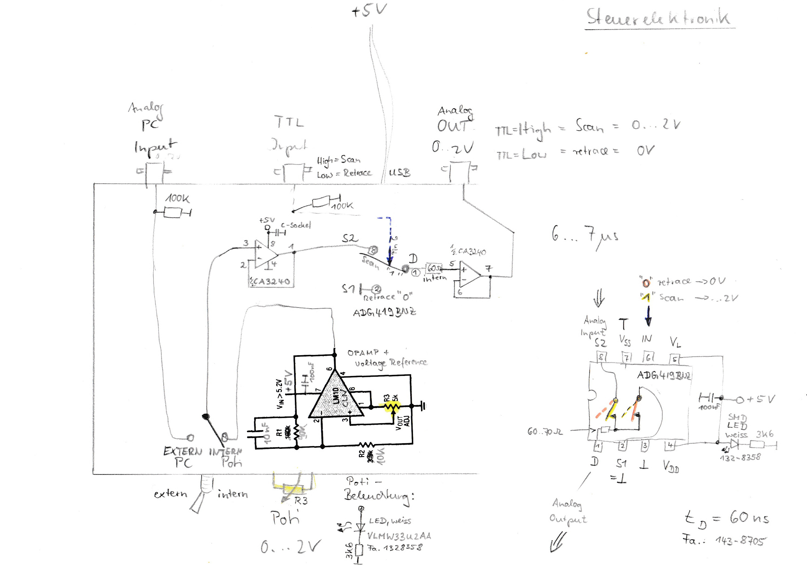

# Pockel_cell_driver
An open source electronic circuit to drive Pockel cells.

## Credit:
- The Pockels' cell driver was inspired by earlier devices designed and built by R. Berndt ([HIH Tübingen](<https://www.hih-tuebingen.de/en/>)), part of a project of [T. Euler's lab](<http://www.eye-tuebingen.de/eulerlab/>). See image below for original schematic

## What was done in this derivative work:
1. Bring the designs of the board to KiCad - Done by F. Janiak
2. Update the KiCad designs to KiCad 5 - Done by A. Maia Chagas
3. Document, add licenses to the repository - Done by A. Maia Chagas
4. Link board to KitSpace - To be done

Footprints for KiCad downloaded from [ultralibrarian](<https://app.ultralibrarian.com>).

- [CA3240](<https://app.ultralibrarian.com/details/f0fe15b2-106c-11e9-ab3a-0a3560a4cccc/Intersil/CA3240AE?uid=155cdc561030ca9b&exports=KiCAD>)
- [LM10CLN](<https://app.ultralibrarian.com/details/49f2f7e6-1073-11e9-ab3a-0a3560a4cccc/Texas-Instruments/LM10CLN?uid=6d97a49d38e0b250&exports=KiCAD>)

## Original Schematic

